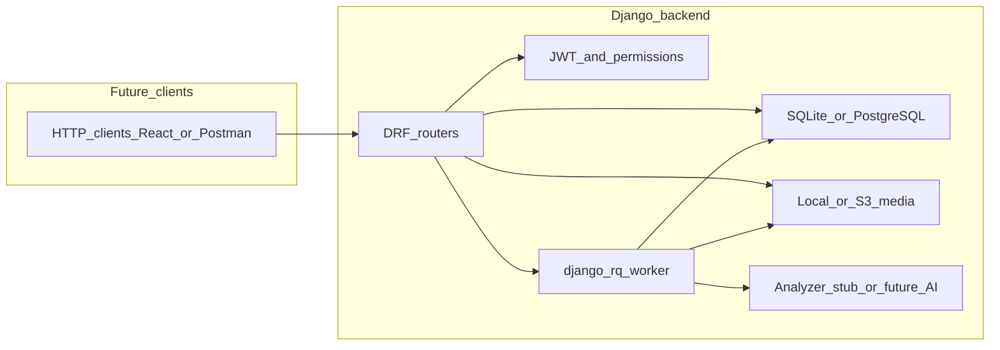

# Django backend plan: No More Cheaters

## Scope (this iteration)

- **In scope:** A single **Django + Django REST Framework** backend under [`e:\final_project\backend`](e:\final_project\backend) implementing the report’s **REST-centric** responsibilities (FR1–FR14 at the API/data layer). **Primary target:** run **locally on your machine** as a demo (no hosting decision yet).
- **Out of scope for now:** React frontend, Firebase/Firestore as primary store, and the **full** OpenCV/YOLO/MediaPipe pipeline. Async **analysis** should still exist as **jobs** (FR5–FR10): either a **stub** that writes realistic-shaped JSON/alerts, or a thin wrapper you replace later—without blocking API design. Choosing a **specific** cloud host can wait; the codebase should be **ready to host** via standard patterns below.

## Simple and hosting-compatible (design intent)

- **12-factor style:** `SECRET_KEY`, `DEBUG`, `ALLOWED_HOSTS`, `DATABASE_URL`, `REDIS_URL`, and optional S3 credentials come from **environment** (`.env` locally, provider dashboard in production)—no secrets in git.
- **Database:** **SQLite** for the quickest local demo (zero install). For deployment, **PostgreSQL** via `DATABASE_URL` is the default target (supported by Render, Railway, Fly.io, Heroku, most VPS guides). **MySQL/MariaDB** remains a drop-in alternative via the same env pattern if your host prefers it.
- **Background jobs:** Use **django-rq** + **Redis** (smaller API than Celery, easy to reason about). One **worker** process (`rqworker` or equivalent) alongside the web process matches how most PaaS and Docker setups run Django. **Optional:** add **docker-compose** with `web + redis + worker (+ postgres)` so “local” matches “hosted” topology without surprises.
- **Uploaded videos:** **`MEDIA_ROOT` on disk** for local demo. On typical **ephemeral** hosts, disk is not durable—switch **`DEFAULT_FILE_STORAGE`** to **django-storages** + **S3-compatible** bucket when `AWS_STORAGE_BUCKET_NAME` (or compatible env) is set; same code paths, different backend.
- **Static files:** **WhiteNoise** (or collectstatic behind nginx) for production—standard Django hosting pattern.

## Local demo first (current intent)

- **Database:** **SQLite** for the simplest path on Windows. Same migrations apply when you point `DATABASE_URL` at PostgreSQL.
- **Redis:** Required for **django-rq** (lightweight). Install Redis locally, or run **only Redis** in Docker while Django runs on the host—keeps dependencies small.
- **Videos:** **`MEDIA_ROOT`** until you enable S3-compatible storage for a hosted build.
- **Clients:** **Postman** / **curl** for the demo API.

## Context (unchanged from thesis)

- Post-hoc flow: upload → queue → offline processing → persisted alerts/reports for human review.
- FR/NFR mapping remains the same; implementation uses **Django + DRF + django-rq** (Redis-backed queue) instead of Celery unless you later standardize on Celery for team reasons.

## Target architecture (Django-only)

**Happy path:** Client obtains JWT → uploads video (validated, hashed) → file on disk/S3 + `Video` row → `AnalysisJob` queued → worker runs analyzer (stub now) → `Alert` / `AnalysisReport` rows → client polls or fetches report endpoints (FR11/FR12). Admins adjust `SystemSettings` (FR13); `AuditLog` records critical actions (FR14).

## Suggested Django app split

| App | Responsibility |

|-----|----------------|

| `accounts` | User model/profile, roles (`instructor`, `admin`), JWT views |

| `exams` or `proctoring` | `Video`, `AnalysisJob`, `AnalysisReport`, `Alert` |

| `config` | `SystemSettings` singleton or key-value |

| `audit` | `AuditLog` + signals/helpers |

Use **DRF serializers/viewsets** with explicit **permission classes** (`IsAdminUser` / custom role checks).

## FR mapping (Django implementation)

- **FR1:** JWT auth + role on user/profile; protect all write/read routes appropriately.
- **FR2–FR4:** `FileField` or direct stream to storage; validate with `python-magic` or extension + size limits + optional **ffprobe**; **SHA-256** stored on `Video`; reject duplicates or return existing id.
- **FR5–FR10:** `AnalysisJob` with status machine; **django-rq** job loads video path, calls analyzer, saves score/events, creates alerts when above threshold from `SystemSettings`.
- **FR11–FR12:** List/detail serializers including nested alerts and explainable fields.
- **FR13:** PATCH settings (admin-only); optionally mirror in Django Admin.
- **FR14:** Create `AuditLog` on login, upload, job start/complete, settings change, export.

## NFR (backend side)

- **NFR1:** For **local demo**, HTTP on `localhost` is acceptable; use **env-based secrets** and avoid committing keys. For **future deployment**, add HTTPS, stricter `MEDIA` access, and retention jobs deleting raw video after N days.
- **NFR2:** For demo, web + one RQ worker is enough; design **indexes** on hash and job status anyway. For production: stateless web + separate worker process(es) + Redis + managed PostgreSQL; scale workers by count.
- **NFR3:** Not primary for backend-only (API clarity + pagination + consistent error schema help future UI).
- **NFR4:** Alert payload includes `reason_code`, `confidence`, optional `frame_index` / evidence key—matches “explainable” fields for later UI.

## Async processing

- **django-rq** with **Redis** as the queue backend: enqueue jobs from views/signals; **worker** runs `process_analysis_job(job_id)` (or similar). Fewer moving parts than Celery for a student project; still **production-grade** and widely used.
- **Stub analyzer:** returns fixed or random-but-valid JSON matching your final schema so the rest of the system can be tested end-to-end before GPU models exist.

## Testing

- **pytest-django** + DRF `APIClient`: auth, role denial, upload + dedup, job lifecycle, admin settings.
- Optional: factory-boy for `Video`/`AnalysisJob`.

## Phased delivery (backend-only)

1. **Project + auth + core models + migrations**
2. **Upload + dedup + video metadata API**
3. **RQ job + stub analyzer + report/alert APIs**
4. **Admin settings + audit log + retention command**
5. **Tests + OpenAPI schema** (drf-spectacular optional) for future React client

## Deferred (explicitly not in this plan)

- **Picking a host:** provider and domain—code is shaped for common PaaS/VPS deploys (env vars, `gunicorn`, worker + Redis + PostgreSQL, optional S3). Final choice after a **stable demo**.
- React dashboard, Firebase Auth/Storage, standalone `ai-service/` repo.
- Full YOLO/OpenCV/MediaPipe integration—add later inside the **RQ job** or subprocess without changing public API if schemas are stable.
- Branding / thesis document formatting.

## Risks / alignment with report

- Thesis mentions Firebase in conclusions; this Django plan uses **SQL + file storage** instead—document that as an **implementation choice** in the report or add a short “deployment alternatives” note when you write Chapter 5.
- When you add real AI, focus on **idempotent jobs** and **large file handling** (chunked upload, disk space).